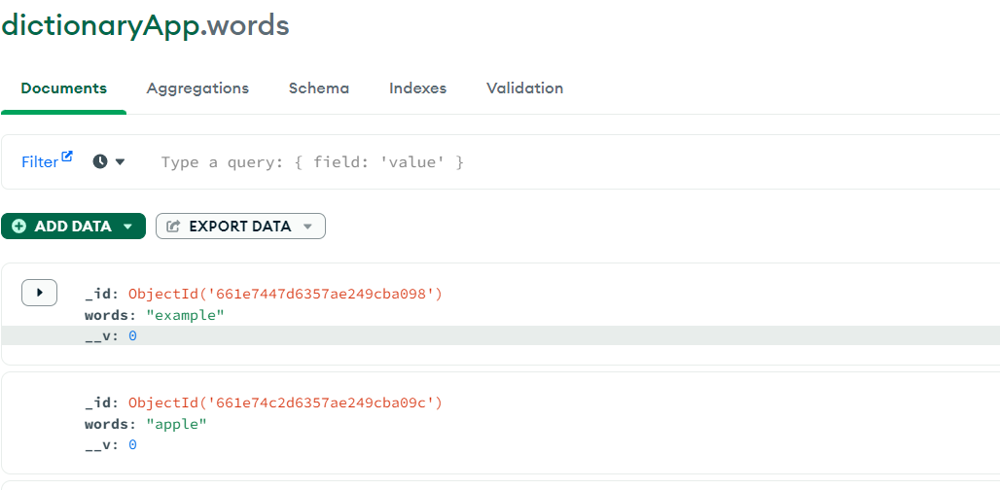

# DictionaryApp-wit

## Create a dictionary app where you can search for words and it outputs word meaning, word pronunciation, audio pronunciation and usage example. 

## and provide MongoDB connection and save the json data returned from the response to DB.

